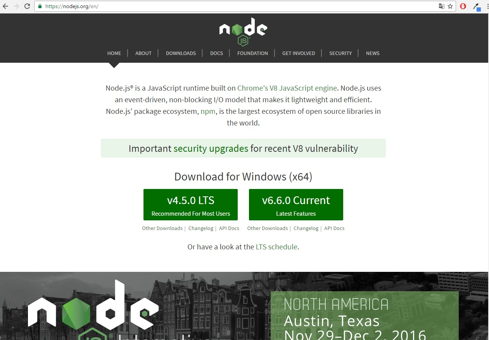
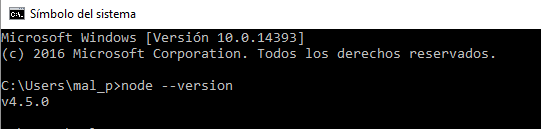

# Tareas Iniciales Sistemas y Tecnologías Web

Este tutorial explicará los pasos para instalar las diferentes herramientas que se utilizarán a lo largo de la asignatura  **SYTW** . Además, se mostrarán
capturas del correcto funcionamiento de las mismas.

## NODE JS
Node JS es un intérprete **Javascript** del lado servidor que cambia la noción de cómo debería trabajar un servidor. La meta principal es permitir al programador
la posibilidad de realizar aplicaciones altamente escalables y permitir manejar miles de conexiones simultáneas en una única máquina física. A continuación, se
procederá a detallar la instalación de **Node JS**  en los diferentes sistemas operativos.
## Instalación de Node Js en Windows
Para la instalación de Node JS en una máquina con Sistema Operativo Windows, lo primero que se debe realizar es visitar su [página web oficial](página web oficial).
Una vez realizado este paso, se puede descargar la versión lts con soporte de actualizaciones, o la última versión existente.

Cuando se haya descargado el instalador de Node JS, se siguen los pasos que indica el instalador y se procederá a abrir una terminal para comprobar que se ha instalado correctamente.
Para la comprobación de que se ha instalado sin ningún tipo de problemas, se realizará lo siguiente en la consola **cmd**:

`node --version`

Este comando mostrará la versión instalada en el ordenador.

Como se puede comprobar en la captura de pantalla, se ha instalado la version lts con soporte de actualizaciones.

## Instalación de Node Js en Linux

Para la instalación de Node JS en el sistema operativo Linux, se puede realizar o bien descargando desde la web oficial el archivo correspondiente o bien se puede realizar mediante línea
de comandos.
# Versión LTS
`curl -sL https://deb.nodesource.com/setup_4.x | sudo -E bash -
sudo apt-get install -y nodejs`

# Versión 6
`curl -sL https://deb.nodesource.com/setup_6.x | sudo -E bash -
sudo apt-get install -y nodejs`

Para compilar e instalar addons nativas de npm se necesita instalar el build tools. Para ello se debe utilizar el siguiente comando:

`sudo apt-get install -y build-essential`
