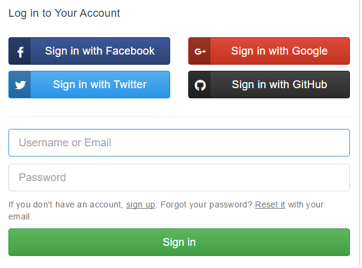
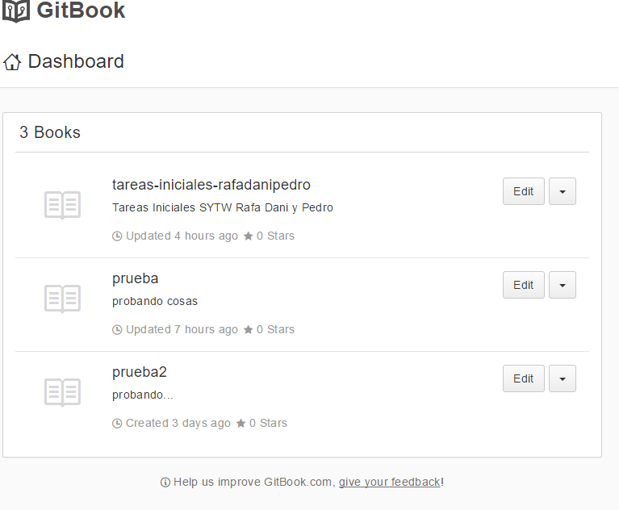
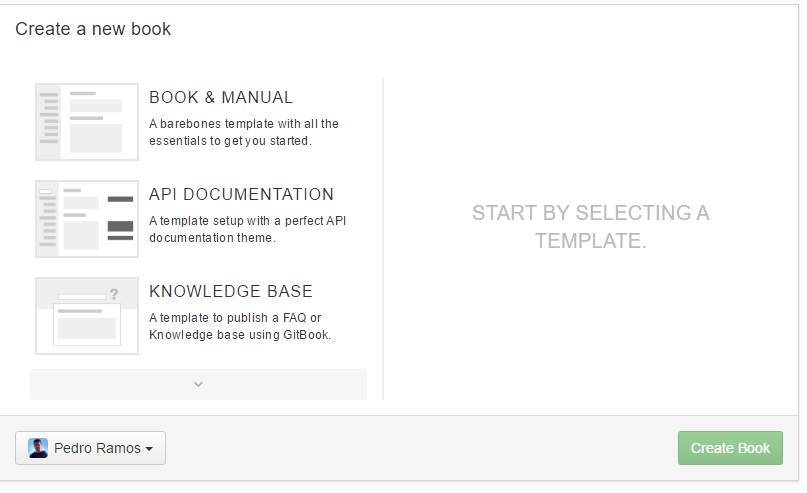
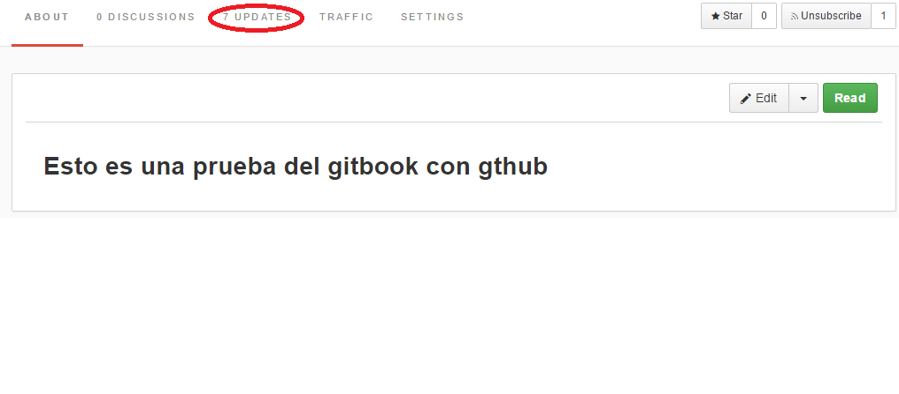
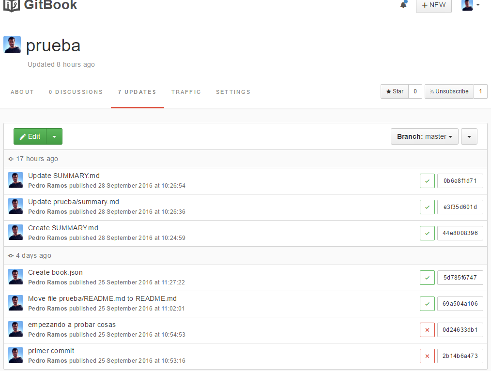

## ¿Qué es Gitbook?

**Gitbook** es una plataforma que permite al usuario publicar la documentación  de su proyecto utilizando diferentes plantillas . Las plantillas que posee Gitbook  para crear una documentación son:

  * Documentación tipo Libro.
  * Documentación de una API.
  * Base de conocimientos.

Para poder utilizar la plataforma Gitbook, se puede realizar de manera online o mediante su aplicación de escritorio.Para la descarga de la aplicación de escritorio, se debe visitar el siguiente enlace [Gitbook Editor](https://www.gitbook.com/editor).

Sin embargo, si se quiere realizar de manera online, se puede iniciar sesión mediante  **Twitter**,**Facebook**,**Google+** o **Github**.

Cuando se ha elegido el método de inicio de sesión, aparecerá una pantalla similar a la siguiente la cual muestra los diferentes libros que se han realizado hasta el momento.

En caso de ser la primera vez que se inicia sesión, aparecerá la ventana de creación de un libro.

Una vez elegida la plantilla del tipo de libro que se va a realizar, se procederá a modificar el libro. Para empezar a realizar la documentación del proyecto, en el tablero donde se muestran los libros creados, se da a la opción **edit** que se encuentra a la derecha del mismo. A continuación, se abrirá una pantalla en la que se podrá empezar a crear ficheros **.md** y carpetas en el libro. Algo importante en Gitbook, es que posee un control de versiones del proyecto que se está realizando de una manera similar a como lo hace Github, con la diferencia de que Gitbook realiza las confirmaciones (**commits**) de manera automática según se guardan los cambios realizados en el proyecto.
Para comprobar los cambios que se han  realizado en el libro creado, se debe ir al **dashboard** del libro e ir a la opción **Updates**

Una vez dentro, se puede comprobar el historial de confirmaciones que se han realizado en el libro.

Cuando el libro está creado, se puede poner a disposición pública o mediante una tasa de pago mensual ponerlo de manera privada. Además, también se puede añadir a contribuidores para poder realizar un libro en comunidad mediante las opciones **setting** del libro.
Otra de las opciones configurables en un libro, es la sincronización mediante Github. Esto en lo que consiste, es que se puede crear un repositorio en Github, realizar los diferentes archivos **SUMMARY.md, README.md y diferentes carpetas** en github y sincronizarlo a Gitbook para poder crear la publicación del mismo al público. Véase [Cómo sincronizar Gitbook con Github](./sincroniza_gitbook.md).
Además, Gitbook también permite añadir plugins en el libro para poder crear contenido multimedia en el mismo .Véase [Cómo utilizar plugins en Gitbook](./plugins_gitbook.md).
