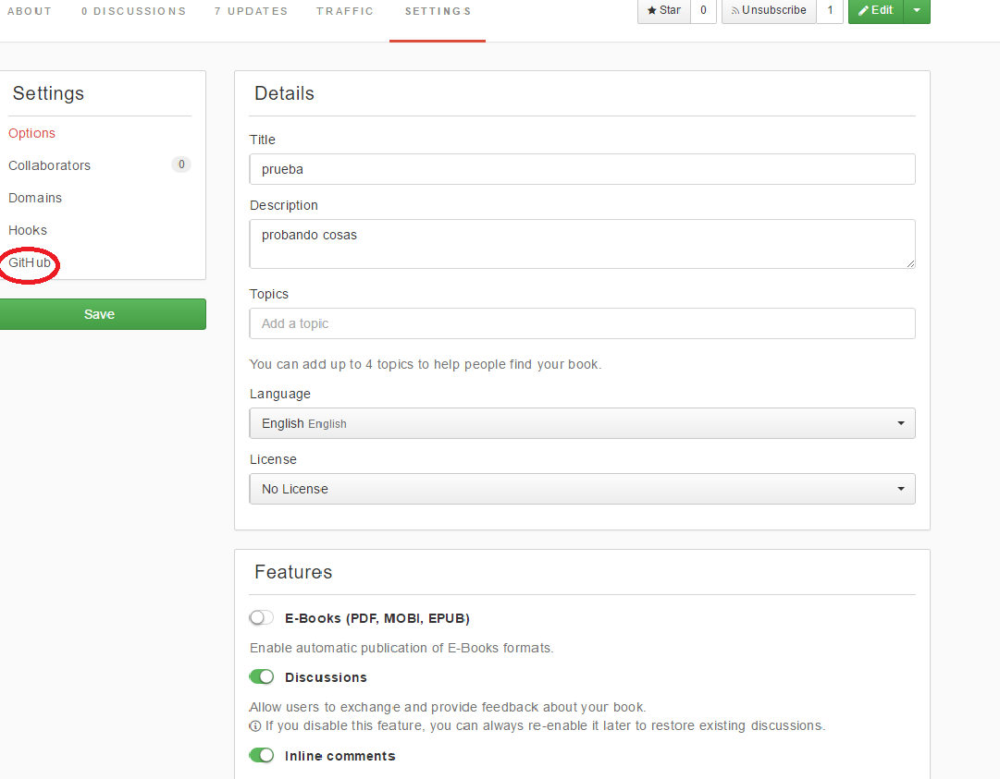
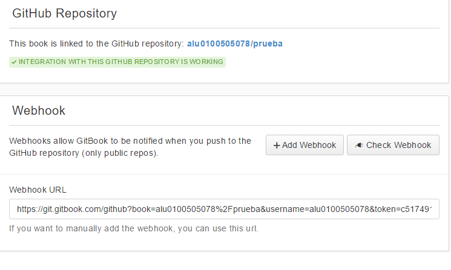

## ¿Cómo sincronizar Gitbook con Github?

Para la sincronización de un repositorio **Github** con la plataforma **GitBook**, lo primero que se tiene que hacer es crear un repositorio **público** en Github y un libro en Gitbook recomendando que tengan el mismo nombre ambos repositorios.

Una vez creados el libro y el repositorio, se debe acceder a las herramientas del libro **Setting** e ir al apartado de Github.

Una vez dentro, se procederá a elegir el repositorio de github con el que se quiere sincronizar.

Elegido el repositorio, se prosigue pulsando en el botón **Sync** verde que aparece. Una vez realizada esta operación, si todo ha salido bien debería de aparecer un mensaje en verde indicando que la intengración con Github está funcionando. En caso de que no haya funcionado correctamente, comprobar el **Webhook** y ver que el repositorio que se abre es el correcto.

Para comprobar que funciona la integración con Github, realizar cambios en el libro a crear en el repositorio en Github y comprobar que el libro en Gitbook se ha modificado correctamente.
