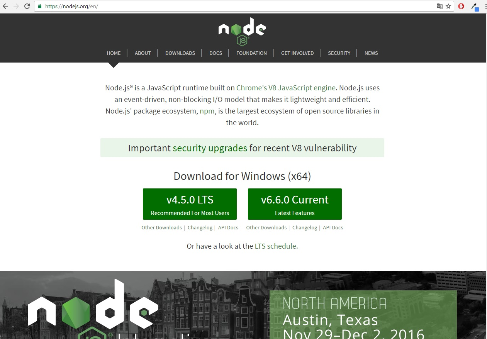
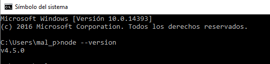

# Tareas Iniciales Sistemas y Tecnologías Web

Este tutorial explicará los pasos para instalar las diferentes herramientas que se utilizarán a lo largo de la asignatura  **SYTW** . Además, se mostrarán
capturas del correcto funcionamiento de las mismas.

## NODE JS
Node JS es un intérprete **Javascript** del lado servidor que cambia la noción de cómo debería trabajar un servidor. La meta principal es permitir al programador
la posibilidad de realizar aplicaciones altamente escalables y permitir manejar miles de conexiones simultáneas en una única máquina física. A continuación, se
procederá a detallar la instalación de **Node JS**  en los diferentes sistemas operativos.
## Instalación de Node Js en Windows
Para la instalación de Node JS en una máquina con Sistema Operativo Windows, lo primero que se debe realizar es visitar su [página web oficial](página web oficial).
Una vez realizado este paso, se puede descargar la versión lts con soporte de actualizaciones, o la última versión existente.

Cuando se haya descargado el instalador de Node JS, se siguen los pasos que indica el instalador y se procederá a abrir una terminal para comprobar que se ha instalado correctamente.
Para la comprobación de que se ha instalado sin ningún tipo de problemas, se realizará lo siguiente en la consola **cmd**:

`node --version`

Este comando mostrará la versión instalada en el ordenador.

Como se puede comprobar en la captura de pantalla, se ha instalado la version lts con soporte de actualizaciones.

## Instalación de Node Js en Linux

Para la instalación de Node JS en el sistema operativo Linux, se puede realizar o bien descargando desde la web oficial el archivo correspondiente o bien se puede realizar mediante línea
de comandos.
# Versión LTS
`curl -sL https://deb.nodesource.com/setup_4.x | sudo -E bash -
sudo apt-get install -y nodejs`

# Versión 6
`curl -sL https://deb.nodesource.com/setup_6.x | sudo -E bash -
sudo apt-get install -y nodejs`

Para compilar e instalar addons nativas de npm se necesita instalar el build tools. Para ello se debe utilizar el siguiente comando:

`sudo apt-get install -y build-essential`

## NPM
**NPM** es el gestor de paquetes para Javascript que se utiliza para instalar en Node los paquetes o librerías que se vayan a utilizar en una aplicación. Cuando se utiliza npm, se instala una dependecia
en un proyecto que permite utilizarlo en la aplicación que se este desarrollando. Para la comprobación de que el comando npm funcion correctamente, se utilizará para la instalación del paquete express de
Node JS.

## Express

**Express** es un framework web que se utiliza en **Node JS** para crear aplicaciones webs. Express esta basado en [Connect](https://github.com/senchalabs/connect),que es un framework de manejo de servidores
HTTP el cual provee plugins de alto rendimiento conocidos como **middleware**. Un middleware es  un software que asiste a una aplicación para interactuar o comunicarse con otras aplicaciones, software, redes, hardware y/o sistemas operativos.
Para instalar express.js en el sistema de manera global se debe utilizar el siguiente comando:

`sudo npm install -g express`

Esto lo que hará, es crear una dependencia en el proyecto con el paquete express en la versión que se haya descargado.

## Package.json

**Package.json** es el fichero que se crea para indicar las dependecias o paquetes que se están utilizando en un proyecto. Este fichero, tiene el formato **JSON** que  es un formato de texto ligero para intercambio de datos. Un fichero JSON se
caracteriza porque tiene los datos incluido entre {  }.
Una característica que utiliza el fichero Package.json, es que  indica la version del paquete que se instala en un proyecto mediante el sistema de versionado semántico (x.y.z).
Para crear un fichero json hay que utilizar el siguiente comando:

`npm init`
