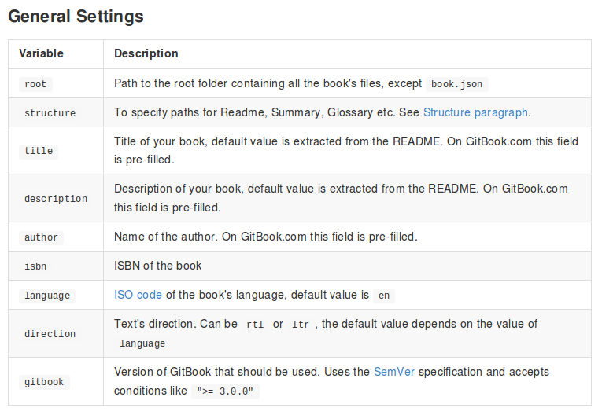

# Para qué se usa book.json

A la hora de utilizar Gitbbok, tenemos la posibilidad de configurar distintos parámetros del mismo. Para ello utilizaremos el archivo _book.json_. En este documento podemos incluir numerosas opciones, por ejemplo, si los archivos de texto se encuentran en otra carpeta, que plugins utilizaremos para nuestro libro o en que idioma lo escribiremos. La lista completa se puede encontrar en la propia [página de Gitbook](https://toolchain.gitbook.com/config.html).

